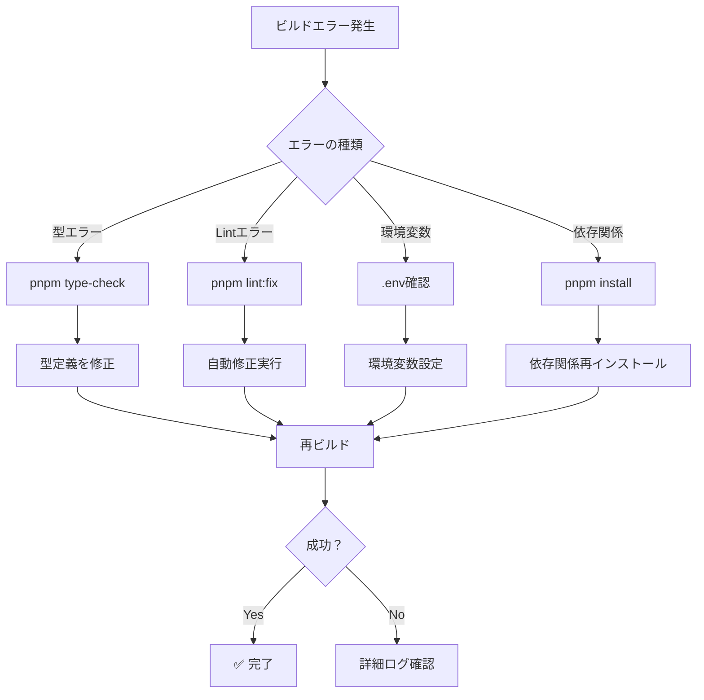

# Fix Build Skill

このスキルは、Next.jsプロジェクトのビルドエラーを効率的に診断・修正するためのガイドです。

## ビルドプロセス

```bash
pnpm build
```

このコマンドは以下を実行します:

1. TypeScriptのコンパイル
2. Next.jsページの静的生成
3. サーバー・クライアントバンドルの最適化
4. `.next/`フォルダへの成果物出力

## よくあるビルドエラーと解決方法

### 1. TypeScript型エラー

#### エラー例

```
Type error: Property 'id' does not exist on type 'Player'
```

#### 診断

```bash
pnpm type-check
```

#### 解決方法

```typescript
// ❌ 間違い
const playerId = player.playerId; // 存在しないプロパティ

// ✅ 修正
const playerId = player.id; // 正しいプロパティ名

// 型定義を確認
import type { Player } from '@/types/game';
```

### 2. モジュールインポートエラー

#### エラー例

```
Module not found: Can't resolve '@/lib/utils'
```

#### 診断

```bash
# ファイルの存在確認
ls -la src/lib/utils.ts

# tsconfig.jsonのパス設定確認
cat tsconfig.json | grep paths
```

#### 解決方法

```typescript
// ❌ 間違い
import { utils } from '@/lib/utils'; // ファイルが存在しない

// ✅ 修正1: 正しいパスを使用
import { utils } from '@/lib/helpers';

// ✅ 修正2: ファイルを作成
// src/lib/utils.ts を作成
```

### 3. 環境変数未定義エラー

#### エラー例

```
Error: NEXT_PUBLIC_SUPABASE_URL is not defined
```

#### 診断

```bash
# 環境変数の確認
echo $NEXT_PUBLIC_SUPABASE_URL

# .env ファイルの存在確認
ls -la .env*
```

#### 解決方法

```bash
# .env.local ファイルを作成（開発環境）
cp .env.example .env.local

# 必要な環境変数を設定
NEXT_PUBLIC_SUPABASE_URL=https://xxx.supabase.co
NEXT_PUBLIC_SUPABASE_ANON_KEY=xxx
SUPABASE_SERVICE_ROLE_KEY=xxx
```

**本番ビルドの場合**:

```yaml
# GitHub Actionsで環境変数を設定
env:
  NEXT_PUBLIC_SUPABASE_URL: ${{ secrets.PROD_NEXT_PUBLIC_SUPABASE_URL }}
  NEXT_PUBLIC_SUPABASE_ANON_KEY: ${{ secrets.PROD_NEXT_PUBLIC_SUPABASE_ANON_KEY }}
```

### 4. Biomeリンティングエラー

#### エラー例

```
Error: Biome check failed with 5 errors
```

#### 診断

```bash
pnpm lint
```

#### 解決方法

```bash
# 自動修正
pnpm lint:fix

# フォーマット修正
pnpm format
```

### 5. 未使用import/変数エラー

#### エラー例

```
Error: 'useState' is defined but never used
```

#### 解決方法

```typescript
// ❌ 間違い
import { useState, useEffect } from 'react'

export function Component() {
  useEffect(() => {}, [])  // useState未使用
  return <div>Hello</div>
}

// ✅ 修正
import { useEffect } from 'react'  // 不要なimportを削除

export function Component() {
  useEffect(() => {}, [])
  return <div>Hello</div>
}
```

### 6. Server Component vs Client Component

#### エラー例

```
Error: You're importing a component that needs useState.
It only works in a Client Component but none of its parents are marked with "use client"
```

#### 解決方法

```typescript
// ❌ 間違い (Server Component内でuseState使用)
export default function Page() {
  const [count, setCount] = useState(0)  // エラー！
  return <div>{count}</div>
}

// ✅ 修正1: Client Componentにする
'use client'

export default function Page() {
  const [count, setCount] = useState(0)
  return <div>{count}</div>
}

// ✅ 修正2: Client Componentを分離
// app/page.tsx (Server Component)
import Counter from './Counter'

export default function Page() {
  return <Counter />
}

// app/Counter.tsx (Client Component)
'use client'

export default function Counter() {
  const [count, setCount] = useState(0)
  return <div>{count}</div>
}
```

### 7. Async Component エラー

#### エラー例

```
Error: async/await is not yet supported in Client Components
```

#### 解決方法

```typescript
// ❌ 間違い (Client ComponentでAsync/Await)
'use client'

export default async function Page() {  // エラー！
  const data = await fetch('/api/data')
  return <div>{data}</div>
}

// ✅ 修正: useEffectを使用
'use client'

export default function Page() {
  const [data, setData] = useState(null)

  useEffect(() => {
    fetch('/api/data').then(res => res.json()).then(setData)
  }, [])

  return <div>{data}</div>
}
```

### 8. ビルド時のメモリ不足

#### エラー例

```
FATAL ERROR: Reached heap limit Allocation failed - JavaScript heap out of memory
```

#### 解決方法

```bash
# Node.jsヒープサイズを増やす
NODE_OPTIONS=--max-old-space-size=4096 pnpm build
```

**package.json**:

```json
{
  "scripts": {
    "build": "NODE_OPTIONS=--max-old-space-size=4096 next build"
  }
}
```

### 9. Supabase接続エラー

#### エラー例

```
Error: Failed to fetch from Supabase
```

#### 診断

```bash
# Supabase URL確認
curl $NEXT_PUBLIC_SUPABASE_URL/rest/v1/

# 認証確認
echo $NEXT_PUBLIC_SUPABASE_ANON_KEY
```

#### 解決方法

```typescript
// クライアント作成時のエラーハンドリング
import { createClient } from '@supabase/supabase-js';

const supabaseUrl = process.env.NEXT_PUBLIC_SUPABASE_URL;
const supabaseKey = process.env.NEXT_PUBLIC_SUPABASE_ANON_KEY;

if (!supabaseUrl || !supabaseKey) {
  throw new Error('Missing Supabase environment variables');
}

export const supabase = createClient(supabaseUrl, supabaseKey);
```

## ビルドエラー診断フロー



## 段階的診断手順

### Step 1: キャッシュクリア

```bash
# Next.jsキャッシュ削除
rm -rf .next

# node_modules再インストール
rm -rf node_modules
pnpm install

# 再ビルド
pnpm build
```

### Step 2: 個別チェック実行

```bash
# 1. 型チェック
pnpm type-check

# 2. Lintチェック
pnpm lint

# 3. フォーマットチェック
pnpm format:check

# 4. テスト実行
pnpm test

# 5. ビルド
pnpm build
```

### Step 3: ログ詳細確認

```bash
# 詳細ログでビルド
pnpm build --debug

# TypeScript詳細エラー
pnpm type-check --pretty
```

### Step 4: 環境変数確認

```bash
# ビルド時の環境変数出力
node -e "console.log(process.env)" | grep NEXT_PUBLIC
```

## CI/CDでのビルドエラー

### GitHub Actions でのデバッグ

```yaml
- name: Build for production
  run: pnpm build
  env:
    NEXT_PUBLIC_SUPABASE_URL: ${{ secrets.PROD_NEXT_PUBLIC_SUPABASE_URL }}
    NEXT_PUBLIC_SUPABASE_ANON_KEY: ${{ secrets.PROD_NEXT_PUBLIC_SUPABASE_ANON_KEY }}
    SUPABASE_SERVICE_ROLE_KEY: ${{ secrets.PROD_SUPABASE_SERVICE_ROLE_KEY }}
    NEXT_PUBLIC_APP_ENV: production
    NODE_ENV: production
    # デバッグ用
    DEBUG: '*'
```

### Vercelでのデバッグ

1. Vercelダッシュボード → Settings → Environment Variables
2. 環境変数が正しく設定されているか確認
3. Build Logs で詳細エラーを確認

## プロジェクト固有の注意事項

### Napoleon Game固有のビルド要件

1. **Supabase環境変数必須**:
   - `NEXT_PUBLIC_SUPABASE_URL`
   - `NEXT_PUBLIC_SUPABASE_ANON_KEY`
   - `SUPABASE_SERVICE_ROLE_KEY`

2. **Node.jsバージョン**:
   - Node.js 22.22.0以上必須
   - `.nvmrc` で自動設定

3. **型定義の同期**:
   - `@/types/game.ts` とSupabaseスキーマの一致確認

4. **定数参照**:
   - 文字列リテラル使用禁止
   - `@/lib/constants` から定数をimport

## 緊急対応チェックリスト

ビルドが通らない場合の緊急対応:

- [ ] キャッシュクリア (`rm -rf .next node_modules`)
- [ ] 依存関係再インストール (`pnpm install`)
- [ ] 環境変数確認 (`.env.local` 存在確認)
- [ ] 型チェック (`pnpm type-check`)
- [ ] Lintチェック (`pnpm lint:fix`)
- [ ] 最新のdevelopブランチとマージ
- [ ] Node.jsバージョン確認 (`node -v`)
- [ ] ログ詳細確認 (`pnpm build --debug`)

## 参考リンク

- [Next.js ビルドエラー](https://nextjs.org/docs/messages)
- [TypeScript エラーコード](https://www.typescriptlang.org/docs/handbook/error-codes.html)
- [プロジェクトセットアップ](../../docs/setup/PROJECT_SETUP.md)
- [開発コマンド](../../docs/development/COMMANDS.md)
