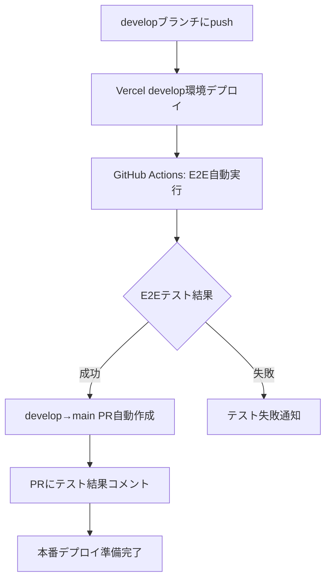

# E2E自動化ワークフロー

## 📋 概要

develop環境へのデプロイ後に自動でE2Eテストを実行し、成功した場合にdevelop→mainの自動PRを作成するワークフローです。

## 🔄 ワークフロー



## 🚀 自動実行トリガー

### 1. **Vercelデプロイ完了後（推奨）**

- developブランチのVercelデプロイ完了を検知
- 自動でE2Eテストを実行

### 2. **手動実行**

```bash
# GitHub Actions画面から手動実行可能
# パラメータ:
# - target_url: テスト対象URL
# - create_pr: PR作成フラグ (true/false)
```

## 📂 関連ファイル

### GitHub Actions

- `.github/workflows/e2e-develop.yml` - メインワークフロー
- `.github/workflows/e2e-production.yml` - 本番用E2E（既存）

### Playwright設定

- `playwright-develop.config.ts` - develop環境用設定
- `tests/global-setup-develop.ts` - develop環境セットアップ

### NPMスクリプト

```json
{
  "test:e2e:develop": "E2E tests against develop environment",
  "test:e2e:develop:full": "E2E tests with HTML report"
}
```

## 🔧 設定項目

### 環境変数

| 変数名                      | 説明                                 | デフォルト値   |
| --------------------------- | ------------------------------------ | -------------- |
| `PLAYWRIGHT_BASE_URL`       | テスト対象URL                        | develop環境URL |
| `SKIP_E2E_TESTS`            | E2Eテストスキップフラグ              | `false`        |
| `PLAYWRIGHT_SKIP_WEBSERVER` | ローカルサーバー起動スキップ         | `true`         |
| `GITHUB_USERNAME`           | GitHub OAuth認証用ユーザー名         | -              |
| `GITHUB_PASSWORD`           | GitHub OAuth認証用パスワード         | -              |
| `VERCEL_AUTH_USERNAME`      | Vercel認証用ユーザー名（後方互換性） | -              |
| `VERCEL_AUTH_PASSWORD`      | Vercel認証用パスワード（後方互換性） | -              |

**注意**: GitHub Secretsでは`E2E_GITHUB_USERNAME`・`E2E_GITHUB_PASSWORD`として設定してください（`GITHUB_`プレフィックスは使用不可）。

### Vercel環境URL

- **Develop環境**: `https://napoleon-game-dev.vercel.app`
- **本番環境**: 設定後に追加予定

## 🧪 E2Eテスト詳細

### テスト対象

- 基本的なゲームフロー
- ナポレオンゲームの主要機能
- UI/UXの動作確認

### 実行環境

- **ブラウザ**: Chromium（ヘッドレス）
- **並列実行**: 無効（安定性優先）
- **リトライ**: 3回（ネットワーク不安定対応）
- **タイムアウト**: 通常より長め（外部環境用）

### レポート生成

- HTML形式のテストレポート
- 失敗時のスクリーンショット・動画
- JSONフォーマットのテスト結果

## 📋 自動PR作成

### PR作成条件

- E2Eテストが全て成功
- developブランチが対象
- 既存のrelease PRがある場合は更新

### PR内容

- **タイトル**: `🚀 Release: Deploy to Production (日付)`
- **説明**:
  - 最近の変更点（コミット履歴）
  - E2Eテスト結果
  - デプロイメント情報
- **ラベル**: `release`, `auto-generated`

### PR更新

- 新しいE2Eテスト結果でコメント追加
- 既存PRの説明更新

## 🔍 トラブルシューティング

### E2Eテスト失敗時

1. **ネットワークエラー**
   - Vercel環境の可用性確認
   - タイムアウト設定の調整

2. **テスト固有の失敗**
   - テストコードの確認
   - develop環境での手動テスト

3. **環境設定エラー**
   - 環境変数の確認
   - Playwright設定の検証

### PR作成失敗時

1. **権限エラー**
   - GitHub token権限確認
   - リポジトリアクセス権限確認

2. **既存PR競合**
   - 手動でPRをクローズ
   - ワークフローの再実行

## 🎛️ 手動操作

### E2Eテスト単体実行

```bash
# ローカル環境でdevelop環境テスト
PLAYWRIGHT_BASE_URL=https://napoleon-game-dev.vercel.app pnpm test:e2e:develop

# HTMLレポート付き
PLAYWRIGHT_BASE_URL=https://napoleon-game-dev.vercel.app pnpm test:e2e:develop:full

# Vercel認証が必要な場合
PLAYWRIGHT_BASE_URL=https://napoleon-game-dev.vercel.app \
VERCEL_AUTH_USERNAME=your-username \
VERCEL_AUTH_PASSWORD=your-password \
pnpm test:e2e:develop
```

### ワークフロー手動実行

1. GitHub Actions画面を開く
2. "E2E Develop Tests"ワークフローを選択
3. "Run workflow"をクリック
4. パラメータを設定して実行

## 📊 メリット

### 🚀 **開発効率向上**

- 手動テスト作業の削減
- PR作成の自動化
- テスト結果の可視化

### 🛡️ **品質保証**

- 本番デプロイ前の自動検証
- develop環境での統合テスト
- 回帰テストの自動実行

### 🔄 **継続的デリバリー**

- develop→main自動フロー
- テスト結果に基づく自動判定
- 本番準備状態の明確化

## 🔗 関連ドキュメント

- [GitHub Actions設定](./GITHUB_ACTIONS.md)
- [Pre-commit Hooks](./PRE_COMMIT_HOOKS.md)
- [自動リリース](./AUTO_RELEASE.md)
- [Jest テスト設定](../testing/JEST_SETUP.md)

---

**注意**: 初回セットアップ時は、Vercel環境URLを実際の環境に合わせて調整してください。
